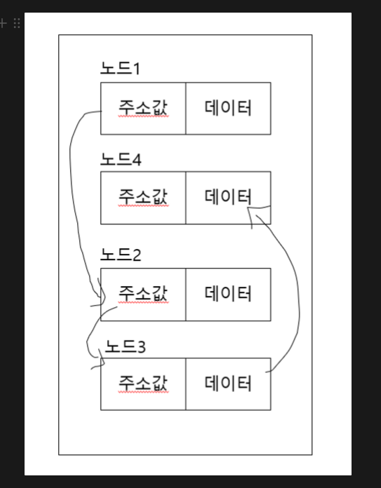
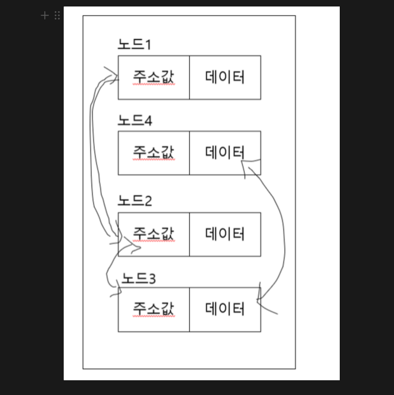
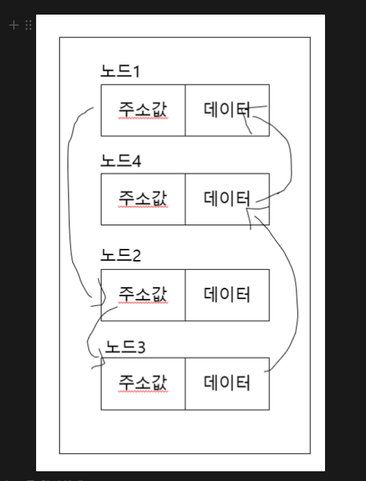
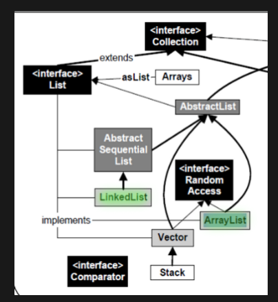

## 연결리스트

리스트를 구현한 자료구조로, 다음 리스트의 위치를 데이터에 포함시키는 방식이다

그래서 링크처럼 연결되었다고 해서 Linked List이다



메모리에 순차적으로 나열된 배열과 달리 연결 리스트는 다음 노드의 주소값을 가지고 있는 형태이다

따라서 메모리 순차적으로 있을 필요가 없으므로 노드와 노드 사이에 값을 넣고 삭제하는 것이 쉽다.

→ 반대로 배열은 인덱스가 있어서 검색 속도가 빠른데에 비해 연결리스트는 인덱스가 없으므로 특정한 노드를 찾기 어렵다

탐색 또는 정렬을 자주하면 **배열**

추가와 삭제가 많은 작업에는 **연결리스트**

## 단순 연결 리스트

다음 노드에 대한 참조(주소값)만 가진 리스트이다

마지막 원소를 찾으려면 리스트 끝까지 가서 찾아야 하기 때문에 O(n)이다

그럴 수가 있을진 모르겠지만 head 노드를 참조하는 주소를 잃어버리면 데이터 전체를 못쓸 수도 있다

마찬가지로 중간 노드를 참조하는 주소가 잘못된 경우에도 뒤쪽 노드들을 못쓰게 된다

## 이중 연결 리스트

다음 노드에 대한 참조와 이전 노드의 참조도 같이 가리키는 연결 리스트이다



만약 중간에 참조값이 유실되서 연결리스트가 끊어졌다면  이중 연결 리스트는 Head와 Tail 노드를 갖고 있기 때문에 둘 중 하나를 가지고 전체 리스트를 순회할 수 있으므로 끊어진 체인을 복구하는게 가능하다

## 원형 연결 리스트



단순 연결 리스트에서 마지막 노드가 처음 노드의 참조를 가지는 리스트이다

여기에 처음 노드가 마지막 노드의 참조를 가지게 되면 이중 원형 연결 리스트가 된다

## 자바에서의 리스트

자바에서는 List 인터페이스를 구현체 중 대표적으로 ArrayList와 LinkedList가 있다



출처 [https://www.nextree.co.kr/p6506/](https://www.nextree.co.kr/p6506/)

LinkedList : AbstractSequentialList 상속

ArraysList : AbstractList 상속

위에서 설명했듯이 Array는 삽입/삭제 시 자료의 위치를 뒤로 혹은 앞으로 이동하는 연산을 수행하는 데에 비해 LinkedList는 참조값만 변경하면 되기 때문에 삽입/삭제에서는 빠르다

하지만 LinkedList의 경우 무작위 접근(random access)가 불가능하고 메모리에 불연속적인 단위로 저장하기 때문에 탐색하는 작업은 느리다

또한 참조값을 저장하기 때문에 메모리를 더 잡아먹는다

## 배열 대신 List를 사용하는 이유

간단하게 배열을 사용하면 되는 걸 List 객체를 사용하는 이유는 뭘까? 

물론 List 객체가 주는 편리함때문에 사용하는 것도 맞지만 다른 이유도 존재한다

자바에서는 변성(Variance)라는 개념이 있다 

타입의 계층 관계에서 서로 다른 타입 간에 어떤 관계가 있는지 나타내는 개념이다 

변성에는 공변(covariant), 반공변(contravariant), 불공변(invariant)이 있다

공변은 함께 변한다는 의미로 상위 타입일 때 하위 타입도 포함시킬 수 있다

```java
Number[] array = new int[5];
```

위의 경우 Number 타입으로  선언한뒤 int 배열을 선언했다.

하지만 배열은 공변이므로 double 타입을 넣을 수 있어서 런타임시 오류를 발생시킨다

반면 자바 제네릭에서는 불공변이므로 부모 타입과 자식 타입이더라도 서로 다른 타입으로 취급한다

```java
List<Nubmer> array = new ArrayList<Integer>();
```

애초에 컴파일 시점부터 오류를 발생시키기 때문에 런타임 오류를 사전에 방지할 수 있다
