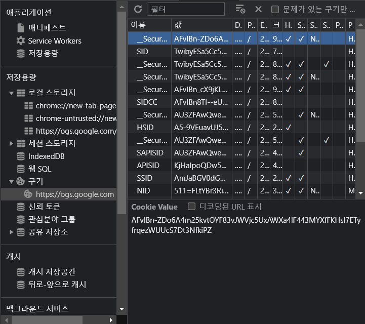

# JWT 토큰의 한계

## 우선 JWT 토큰이란 무엇인가?

주로 기본적인 웹 애플리케이션의 인가 방식을 구축하기위해 사용되는 프로토콜의 일종이다.

> 자세한 기술 설명은 아래 블로그를 참조해주기 바란다.(~~끼워팔기~~)

[JWT 토큰](https://learngoeson.tistory.com/entry/JWT-Token-%EC%8A%A4%ED%94%84%EB%A7%81-%EC%8B%9C%ED%81%90%EB%A6%AC%ED%8B%B0-JWT-%ED%86%A0%ED%81%B0%EC%9D%84-%EC%9D%B4%EC%9A%A9%ED%95%9C-%EC%8A%A4%ED%94%84%EB%A7%81%EB%B6%80%ED%8A%B8-%ED%94%84%EB%A1%9C%EC%A0%9D%ED%8A%B8-%EB%A7%8C%EB%93%A4%EA%B8%B0-1)

이러한 JWT 인가 방식 이전에는 세션 기반의 인가방식이 존재했다.

우선 세션방식과 JWT 방식에 대해 간단히 설명후 JWT 토큰이 어째서 한계점을 가지는지 얘기해보자.

## 세션방식

세션 기반 인가방식의 경우 `Server`에서 `Client`의 인증 상태를 유지하는 방식이며, 기본적으로 크게 4개의 단계를 거치게된다.

1. `Client`가 `Server`로 로그인 요청을 보내게된다. 이때 스프링부트에서는 기본적으로 `loadByUsername()`를 기반으로 로그인 요청이 진행된다.
   1. 이때 로그인은 `username`과 `password`를 기반으로 유효한 요청인지 판단한다.
   2. 만약, 인증이 유효하다면 세션ID를 생성한다.
2. `세션 ID` 생성 후 Server는 세션 ID를 쿠키 형태로 Client에게 전송한다.
   1. Client는 해당 쿠키를 이용하여 서버에 API를 요청시 함께 전달
3. 서버는 클라이언트가 보낸 세션 ID의 유효성을 처리한 후 API를 호출한다.
4. 로그아웃 요청을 받으면 서버는 해당 클라이언트의 세션 ID를 무효화하고, 클라이언트는 이후 쿠키를 전송할 때 해당 세션 ID를 제거하여 인증 상태를 해제한다.

### 😅 엥 잠깐 세션 ID 방식 좋은데요?

실제로 보안성이 높은 편에서 속하기도하며, 많은 곳에서 인가 방식으로 사용한다.

하지만, 자 우리가 다시 생각해봐야할 것은 위의 방식에서 세션을 **어디에** 저장하느냐이다.

세션 ID가 **`Cookie`**에 저장되어 전송되게 된다.

해당 사진은 크롬 브라우저 기준 [구글](google.com) 메인 화면에서 사용되는 쿠키들의 정보이다.

`세션 ID`가 **발행**될 때에는 해당 세션 ID는 **고유한 값**이어야 한다.

또한 회원과 관련된 정보가 포함되어 있기 때문에 더욱더 쿠키를 신뢰하여 사용할 수 없게된다.

또한 이외에도 총 3가지정도의 문제가 존재한다. 이는 필자의 개인적인 의견이기에 참고정도로만 생각해주면 좋겠다.

**1. 확장성이 떨어지는 구조**
세션 기반 인증 방식은 서버 측에서 클라이언트의 인증 상태를 유지하므로, 여러 대의 서버를 사용하는 경우 세션 정보를 공유해야 한다.
이를 위해 세션 정보를 데이터베이스나 공유 캐시에 저장하거나, 로드 밸런서와 같은 기술을 사용하여 해결할 수 있지만, 동기화와 같은 이슈 때문에 복잡해진다.

**2. 사용자 상태 변경시 재요청 이슈**
제목 그대로 회원의 상태가 서버측에서 변경될 경우 클라이언트와 상태를 유지해야하기에, 이를 반영하기위해서 클라이언트의 재요청작업이 필수적이다.

**3. RESTFUL API에서의 호환성**
우선 RESTFUL API란? `STATELESS`한 아키텍쳐이다. 여기서 이상한점을 느낄 수 있는데 세션기반의 인가 방식은 `STATEFULL`한 방식으로 서버에서 
Client side의 정보를 저장한다. 그렇기 때문에 REST API구조를 사용하지 않는다면 모르겠지만, 대부분의 웹 / 애플리케이션에서 REST 구조를 띄고 있기에
세션기반의 인가방식에는 한계가 존재한다. 이로 인해 JWT가 생겨나게된 배경이기도 하다.

> 💡 STATELESS란 server side에 client와 server의 동작 및 상태정보를 저장하지않고 server와 client의 세션이 독립적인 상태를 뜻한다.

## 😃 아 그래서 JWT 쓰면 괜찮은거지?

자 위애서 내가 링크에 걸어놓은 블로그글이 다소 난해하기도 해서 다시 설명을 해보자.

JWT는 `STATLESS`한 환경에서 이용되는 인가 방식중 하나로 대표적인 전략으로 `AccessToken`과 `RefreshToken`전략이 존재한다.

여기서 `RefreshToken`에 대한 이론을 보자면 사용자의 정보 조회와 같은 모든 작업을 `AccessToken`을 통해 하게 되는데 만약 이게 강탈될 경우를 대비하여 refreshToken을 만든다.

그렇기 때문에 대부분의 애플리케이션에선 accessToken의 수명이 짧고, refreshToken의 수명은 길게 책정하는 방법을 사용한다.

하지만, 이 또한 accessToken만으로 서버의 자원이 탈취되는 것은 아니다.
보통 토큰 생성시에 `secretKey`를 기반으로 `HS256` 또는 `BASE64` 알고리즘을 Encoding하여 생성한다.
그렇기에 secretKey의 정확한 값을 알고 암호화할때의 알고리즘 정보를 알고있다면 그대로 `Decode`하여 정보가 탈취되게 되는것이다.

여기서부터 JWT에 대한 나의 지극히 주관적인 의견과 JWT 토큰의 한계에 대해 설명하고자한다. 

**1. 쿠키,세션 스토리지,로컬 스토리지**

만약 인가과정이 성공적으로 끝난 후 서버에서 토큰을 발급하고 그것을 Client Side로 전달해줄 때 어떤 방식이 적절한가에 대한
고민을 나는 개인적으로 많이 가지고 있었다.

헤더의 경우 응답 값을 개발자도구와 같은 Tool을 이용해 확인할 수 있기에 Body에 담아 보내는 방법을 사용하면 안전하게 전달은 가능하다.
하지만, 프론트에서 이를 상태관리 할 때 보통 `세션 스토리지` 또는 `로컬 스토리지`에 저장하게 된다.

해당 저장소 또한 개발자 도구와 같은 Tool로 확인 가능하며 `쿠키`를 사용해도 마찬가지이다.

**2. refreshToken의 존재 의의**

맨 처음 jwt를 공부했을 때 들었던 생각중 하나가 **"AccessToken의 탈취를 방지하기 위해 RefreshToken을 사용하는데 이것도 탈취당하면?"**
이었다. 물론 이론적으로 필요한 것은 맞으나 탈취를 고려한다면 다른 방법을 고안해야 한다고 생각한다. 이에 관해서는 뒤에 다시 설명하겠다.

**3. JWT는 암호화되지 않는다**

JWT에 정보는 암호화되지 않기 때문에 민감한 유저정보는 함부로 포함되어선 안된다.
예를 들어 고유값을 기반으로 JWT 토큰을 생성할 때, 고유하되 무의미 한값을 선택해야한다.

email 또는 전화번호 같은 값은 고유값이나 정보가 유출될 경우 손실이 크기 때문에 이러한 점도 고려하여야한다.

**4.탈취 되었을 경우**

만약 탈취되었을 경우 서버측에서는 이를 막을 방법이 없다.

**블랙리스트**를 운영하는 방법도 있지만 이를 사용하게 되면, JWT의 장점이 사라지는 구조라고 생각해 선호하지 않는다.

또는 런타임 중에 토큰의 **유효기간을 줄이는 방법**이 있지만, 만약 대규모 트래픽을 보유 중인 서비스라면 그로인한 손실이 막심할 것이다.

## 🤔 그럼 JWT도 쓰지 말아야해?

가장 최선의 방법은 Token 구조는 유지하되 보안에 중점을 둬 관리해야한다.

**첫 번째**로는 가장 단순히 `AccessToken`과 `RefreshToken`의 유효기간을 줄이는 것이다.

이에 관해서 AccessToken의 경우 유효기간을 가능한 서비스 이용에 문제가 없는 선에서 짧게 설정하고 RefreshToken은 AccessToken 보다는 길게 설정하거나
RefreshToken을 **1회성**으로 사용하는 방법이 존재한다.(Refresh Token Rotation이라는 방식)

**두 번째**로는 **`RefreshToken`** 자체를 암호화하는 것이다. 하지만, 결국 암호화에 암호화는 구조상 별로기도 하고, 허수인것 같아 선호하지 않는 방식이다.

**세번 째**로는 `AccessToken`과 `RefreshToken`의 접근 범위를 제한하는 것이다.

Access token과 Refresh token을 사용할 수 있는 범위를 제한하여, 탈취된 토큰으로 다른 악의적인 작업을 수행할 수 있는 범위를 제한할 수 있다.
RefreshToken을 오로지 AccessToken을 재발급 하는 용도로만 사용하는 것이다.

**네 번째**로는 `HTTPS` 를 사용하면 토큰 전송시에 암호화 되어 전송되기 때문에 탈취된 토큰을 해독할 수 없다.

**마지막**으로는 `다중 인증 요소(MFA)`를 사용하여, 악의적인 사용자가 로그인에 성공하더라도, 다른 보안 인증 수단을 추가로 거쳐야만 JWT 토큰을 발급받을 수 있도록 합니다.

### 그래서 사실

나는 사실 JWT토큰 방식을 Restful API를 사용하며, 울며겨자먹기로 사용하고 있지만, 허점이 많은 인가 방식이라고 생각한다.

그래서 최근에는 `OAuth2.0` 인가 방식을 사용하는 것이 제일 최선이라고 생각한다.

OAuth2.0을 사용할 경우 `Resource Server`에서 직접 AccessToken과 RefreshToken을 발급하여주기 때문에 좋은 방법이라고 생각된다.

하지만 최근 진행중인 프로젝트에서는 Github OAuth를 사용하고 있는데 Github사에서는 토큰을 **별도로 제공해주지 않아** 직접 구현하게되었다...

그러면서 보이는 문제들을 간단히 학습하며 서술한 것이다.

OAuth2.0 외에도 `OpenID Connect`라는 OAuth2.0 프로토콜을 사용하는 라이브러리를 이용할 수도 있다.

## 결론

JWT 토큰 구조를 버릴 수는 없다고 생각한다. Restful API에서 가장 효율적인 성능을 나타내긴하나, 보안전략을 잘 구성해야한다고 생각한다.

또는 자체 회원가입이 필요하지 않다면 OAuth2.0을 이용하는 것이 최선의 방법이라고 생각한다.

## 참고
코딩애플님이 올리신 영상인데, JWT를 최대한 간단히 풀어서 설명한것이기에 한번쯤 보면 좋을것 같다.

[코딩애플 유튜브](https://www.youtube.com/watch?v=XXseiON9CV0&t=327s) 