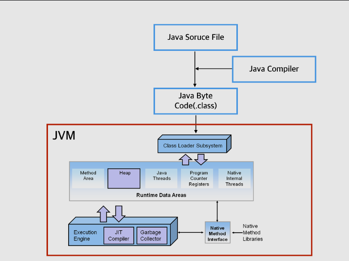
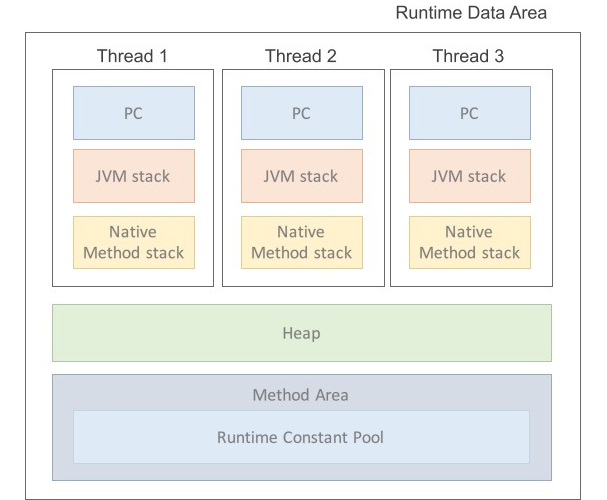
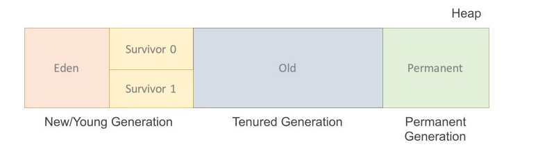

# JVM

Java Virtual Machine이 약자로 Java Byte Code를 OS에 맞게 해석해주는 역할을 하는 가상 머신이다.

자바 컴파일러가 .class 확장자를 Java byte code로 변환하는데, 이 Java byte code는 기계어가 아니기 때문에 OS에서 바로 실행이 안된다.

JVM은 c언어 같은 네이티브 언어에 비해 속도가 느렸지만 JIT(Just In Time)컴파일러 구현을 통해 단점을 보완했다.

바이트코드는 JVM에 의해 해석되어 실행되기 때문에 OS에 상관없이 실행된다. → JVM은 OS에 독립적이지만 의존적이다.

JVM은 클래스 로더(Class Loader), 런타임 데이터 영역(Runtime Data area), 실행 엔진(Execution Engine)으로 구성된다.

1. 프로그램이 실행되면 JVM은 OS로부터 프로그램이 필요로 하는 메모리를 할당받는다. (JVM은 이 메모리를 용도에 따라 여러 영역으로 나누어 관리한다.)

1. 개발자가 작성한 소스코드(.java)를 자바 컴파일러가(Java Compiler) 컴파일을 해서 바이트코드로 된 클래스파일을 만든다.(.class) - 컴퓨터가 아닌 JVM이 이해할 수 있는 코드이다.

      바이트코드의 각 명령어는 1바이트 크기의 Opcode와 추가 피연산자로 이루어져 있다.

1. 컴파일된 바이트 코드를 JVM의 클래스로더(Class Loader)가 Runtime 시점에 .class파일(바이트코드)을 읽고 JVM으로 로딩한다.

*(동적로딩(Dynamic Loading)을 통해 필요한 클래스들을 로딩 및 링크하여 런타임 데이터 영역(Runtime Data areas)에 올린다. 런타임 데이터 영역 == JVM의 메모리 영역)*

- 클래스 로더의 세부 동작
    1. 로드 : 클래스 파일을 가져와서 JVM의 메모리에 로드한다.
    2. 검증 : 자바 언어 명세(Java Language Specification) 및 JVM 명세에 명시된 대로 구성되어 있는지 검사한다.
    3. 준비 : 클래스가 필요로 하는 메모리를 할당한다.(필드, 메서드, 인터페이스 등)
    4. 분석 : 클래스의 상수 풀 내 모든 심볼릭 레퍼런스를 다이렉트 레퍼런스로 변경한다.
    5. 초기화 : 클래스 변수들은 적절한 값으로 초기화한다. (static 필드)

1. 로딩된 class 파일(바이트코드)들은 실행엔진(Execution Engine)이 명령어 단위로 하나씩 가져와서 실행한다. 

(*Class Loader를 통해 JVM 내의 Runtime Data Areas에 배치된 바이트 코드는 Execution Engine에 의해 실행된다.)*

1. 인터프리터 : 바이트 코드 명령어를 하나씩 읽어서 해석하고 실행한다. 전체적인 실행 속도가 느린 단점을 가진다.
2. JIT 컴파일러(Just-In-Time Compiler) : 인터프리터의 단점을 보완하기 위해 도입된 방식으로 바이트 코드 전체를 컴파일하여 바이너리 코드로 변경한다. 
                                                            이후에는 해당 메서드를 더 이상 인터프리팅 하지 않고, 바이너리 코드로 직접 실행하는 방식이다.
                                                            바이트 코드 전체가 컴파일된 바이너리 코드를 실행하는 것이기 때문에 전체적인 실행속도가 인터프리터 방식보다 빠르다.

- Runtime Data Areas

JVM이 프로그램을 수행하기 위해 OS로부터 별도로 할당받은 메모리 공간이다.

Heap과 Method는 모든 스레드가 공유하고, 나머지는 스레드마다 생성한다.

- PC Register
    
    Thread가 시작될 때 생성되며, 생성될 때 마다 생성되는 공간으로 스레드마다 하나씩 존재한다.
    
    Thread가 어떤 부분을 어떤 명령으로 실행해야할 지에 대한 기록을 하는 부분으로, 현재 수행 중인 JVM 명령의 주소를 갖는다.
    

- JVM Stack
    
    Thread가 시작될 때 생성되며, 지역변수, 매개변수, 메서드 정보, 연산 중 발생하는 임시 데이터 등(local variable)이 저장된다.
    
    메서드 호출 시 각각의 Stack Frame이 생성되고, 메서드 수행이 끝나면 프레임 별로 삭제한다.
    
- Native Method Stacks
    
    Java 이외의 언어로 작성된 native 코드를 위한 Stack(JNI, Java Native Interface)이다. 일반적으로 JVM은 네이티브 방식을 지원한다. 
    
    따라서 스레드에서 네이티브 방식의 메서드가 실행되는 경우에는 Native Method Stacks에 쌓인다. 
    
    일반적인 메서드를 실행하는 경우 JVM 스택에 쌓이다가 해당 메서드 내부에 네이티브 방식을 사용하는 메서드가 있다면, 해당 메서드는 네이티브 스택에 쌓인다.
    
    Java Native Interface를 통해 바이트 코드로 전환하여 저장하게 된다. 
    
    일반 프로그램처럼 커널이 스택을 잡아 독자적으로 프로그램을 실행시키는 영역이다. 이 부분을 통해 C code를 실행시켜 커널에 접근할 수 있다.
    
- Method Area = Class area = Static area (클래스 데이터를 위한 공간)
    
    클래스 정보를 처음 메모리 공간에 로드할 때 초기화되는 대상을 저장하기 위한 메모리 공간이다.
    
    모든 스레드가 공유하는 메모리 영역으로 클래스, 인터페이스, 메서드, 필드, Static 변수 등의 바이트 코드 등을 저장한다.
    
    1. Field Information
    
    멤버 변수의 이름, 데이터 타입, 접근 제어자에 대한 정보
    
    **지역변수**는 스택 프레임 안에서 생성되고, 삭제된다.
    
    **클래스 멤버 변수**는 Method Area에 위치한다. 클래스가 로딩될 때 함께 로딩되며, JVM이 종료될 때 까지 고정된 상태로 위치한다.
    
    **객체 멤버 변수(인스턴스)**는 Heap에 위치한다. GC에 의해 메모리 회수가 이뤄지기 전까지 객체와 함께 존재한다.
    
    1. Method Information
    
    메서드의 이름, 리턴타입, 매개변수, 접근 제어자에 대한 정보
    
    인스턴스 변수와 달리, 메서드는 한 번 로딩되면 인스턴스 모두가 공유하는 코드가 된다.
    
    즉, 인스턴스에 따라 상태가 변화하지 않기 때문에 Method Area에 로딩된다.
    
    1. Type Information
    
    class인지 interface인지의 여부 저장, Type의 속성, 전체 이름, super class의 전체 이름(interface이거나, object인 경우 제외)
    
- Runtime constant pool
    
    Method Area 내부에 존재하는 영역으로, 각 클래스와 인터페이스의 상수뿐만 아니라, 메서드, 필드에 대한 모든 레퍼런스까지 담고 있는 테이블이다. 
    
    즉, 상수 자료형을 저장하여 참조하고 중복을 막는 역할을 수행한다.
    

- Heap (객체를 위한 공간)
    
    런타임 시 동적으로 할당하여 사용하는 영역, new연산자로 생성된 객체와 배열을 저장한다. (문자열 상수도 Heap에 저장된다.)
    
    당연히, method area에 올라온 클래스들만 객체로 생성할 수 있다.
    
    인스턴스는 소멸 방법과 소멸 시점이 지역 변수와 다르기에 힙이라는 별도의 영역에 할당된다. JVM은 더이상 인스턴스의 존재 이유가 없을 때 소멸시킨다.
    

힙은 세 부분으로 나뉜다.

1. Permanent Generation

생성된 객체들의 정보의 주소값이 저장된 공간이다. Class Loader에 의해 load되는 Class, Method 등에 대한 Meta 정보가 저장되는 영역이고, JVM에 의해 사용된다.

Reflection을 사용하여 동적으로 클래스가 로딩되는 경우에 사용된다.

내부적으로 Reflection 기능을 자주 사용하는 Spring Framework를 이용할 경우 이 영역에 대한 고려가 필요하다.

1. New/Young 영역

Eden : 객체들이 최초로 생성되는 공간

Survivor 0 / 1 : Eden에서 참조되는 객체들이 저장되는 공간

1. Old 영역

New area에서 일정 시간 참조되고 있는, 살아남은 객체들이 저장되는 공간이다.

Edn 영역에 객체가 가득차게 되면 첫 번째 GC(minor GC)가 발생한다. Eden 영역에 있는 값들을 Survivor 1 영역에 복사하고, 이 영역을 제외한 나머지 영역의 객체를 삭제한다.

PC 레지스터, JVM 스택, 네이티브 메서드 스택은 스레드마다 하나씩 생성되며, 힙과 메서드 영역은 모든 스레드가 공유해서 사용한다.

Method Area와 Heap에 할당된 데이터는 Garbage Colletor의 대상이다.

자바 프로그램은 main 메서드에서부터 시작한다.

일단 JRE는 프로그램 안에 main() 메서드가 있는지 확인한다. 만약 존재한다면 JVM을 실행시켜 부팅하고 프로그램 실행을 위한 사전 준비에 들어간다.

부팅된 JVM은 목적 파일을 받아 그 목적 파일을 실행한다. JVM은 가장 먼저 java.lang 패키지를 스태틱 영역에 가져다 놓는다.

다음으로 개발자가 작성한 모든 클래스와 import package 역시 스태틱 영역에 가져다 놓는다. (loading)

사실 클래스와 클래스에서 import한 package들은 main() 메서드에서 클래스를 사용할 때(new를 통한 인스턴스 생성, static 메서드 호출 등) 스태틱 영역에 로드된다. 여기까지가 JVM의 전처리 과정이다.

그리고 main 메서드를 실행하기 위해 스택 영역에 스택 프레임을 할당한다. 이 스택 프레임은 메서드를 구현하기 위해 작성한 여는 중괄호를 만날 때마다 하나씩 생기는 것이다.

해당하는 메서드의 작업이 끝나서 닫는 중괄호를 만나면 할당한 스택 프레임을 소멸시킨다.  즉, main 메서드는 프로그램의 시작과 끝이다.

main() 메서드가 끝이 나면 JVM을 종료하고 JRE자체도 운영체제 상의 메모리에서 사라진다.

### 메모리 구조 측면에서의 멀티 스레드와 멀티 프로세스

멀티 프로세스는 다수의 데이터 저장영역 즉, 프로세스 개수 만큼의 다수의 T 메모리를 갖는 구조이다.

멀티 프로세스의 경우, 각 프로세스마다 고유의 공간이므로 서로 참조할 수 없다.

멀티 스레드의 메모리 모델은 스택 영역을 스레드 개수만큼 분할해서 쓰는 것이다.

멀티 스레드는 스택 영역만 분할한 것이기 때문에 서로의 스택 영역은 접근할 수 없지만, Method Area(Static Area)와 힙 영역은 공유해서 사용한다.

따라서 멀티 프로세스 대비 메모리를 적게 사용할 수 있는 구조이다.

### Call by Value

자바는 전부 Call by Value이다.

자바에서 메서드에 객체를 전달하는 것이 마치 Call by Reference로 작동하는 것처럼 보인다.

자바에서는 객체를 전달하더라도 동일한 객체를 가리키는 또 다른 레퍼런스를 복사하여 전달한다.

즉, 객체 A가 실제 저장되어 있는 메모리상의 주소값이 아닌 객체 A를 가리키는 또 다른 하나의 레퍼런스 값을 생성하여 그 값을 전달해주는 것이다.

메서드 안에서는 객체를 가리키고 있는 주소'값'을 받은 것이므로 Call by Value가 된다.
